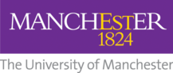

# Deep-Learning-ODE-PDE-Solvers

A Deep Learning Approach to Solving PDEs: Implementing DeepONets with Jax and NumPy

## Project Overview

This project is part of my undergraduate bachelor's thesis in which I explored and implemented neural networks to solve partial differential equations (PDEs). The primary focus was on the DeepONet architecture, which is a deep learning-based approach for learning mathematical operators. Our focus on DeepONets learning antiderivative and implicit-differential operators. 

## Supervisor

**Supervised by**: [Anirbit M.](https://www.github.com/Anirbit-AI)

## Repository Contents

* Burgers(PI_DeepONet).ipynb: Notebook containing the implementation of DeepONet for solving the Burgers' equation.
* DeepONet_Antiderivative(Polynomial_Sampling).ipynb: Notebook demonstrating the implementation of DeepONet for polynomial sampling and antiderivative estimation.
* Heat(PI_DeepONet).ipynb: Notebook containing the implementation of DeepONet for solving the heat equation.

## References

[1] Repository: https://github.com/jdtoscano94/Learning-Python-Physics-Informed-Machine-Learning-PINNs-DeepONets

[2] Lu, L., Jin, P., & Karniadakis, G. E. (2019). Deeponet: Learning nonlinear operators for identifying differential equations based on the universal approximation theorem of operators. arXiv preprint arXiv:1910.03193.

[3] Wang, S., Wang, H., & Perdikaris, P. (2021). Learning the solution operator of parametric partial differential equations with physics-informed DeepONets. Science advances, 7(40), eabi8605.
